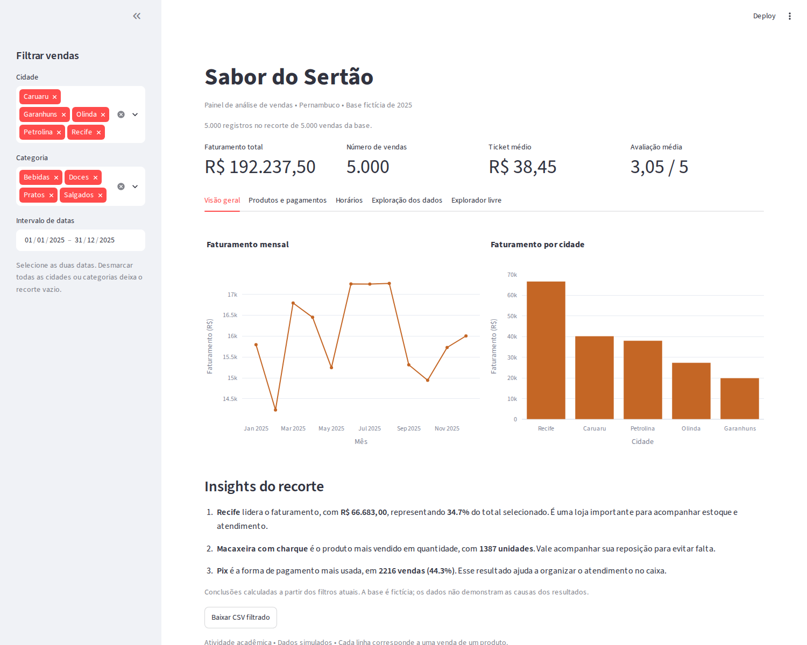

# Sabor do Sertão — Painel de análise de vendas

**Dupla:** Laís Nayara e Anderson Bem  
**Curso:** Análise e Desenvolvimento de Sistemas — Faculdade Senac

## Sobre o projeto

Desenvolvemos este projeto para a atividade prática de análise de dados com Streamlit. O objetivo é apresentar um painel interativo de vendas da rede fictícia Sabor do Sertão, com lojas em Recife, Olinda, Caruaru, Petrolina e Garanhuns.

O painel permite comparar o faturamento das cidades, identificar os produtos mais vendidos, acompanhar as vendas ao longo do ano e analisar as formas de pagamento.

## Tecnologias utilizadas

- Python
- Streamlit
- pandas
- Plotly
- NumPy

## Funcionalidades

- Visualização das primeiras linhas e do resumo estatístico dos dados.
- Contagem de valores ausentes antes e depois do tratamento.
- Indicadores de faturamento total, número de vendas, ticket médio e avaliação média.
- Filtros por cidade, categoria e intervalo de datas.
- Gráfico de linha do faturamento mensal.
- Gráfico de barras do faturamento por cidade.
- Gráfico de barras horizontais dos cinco produtos mais vendidos em quantidade.
- Gráfico da participação das formas de pagamento.
- Mapa de calor das vendas por dia da semana e hora.
- Três conclusões atualizadas conforme os filtros.
- Exportação dos dados filtrados em CSV.
- Explorador livre para enviar outro CSV e escolher os eixos e o tipo de gráfico.

Os indicadores, gráficos de vendas, conclusões e exportação utilizam os filtros selecionados. O explorador livre utiliza o CSV enviado pelo usuário, de forma independente.

## Base de dados e tratamento

A base contém 5.000 registros fictícios de vendas de 2025. O script `gerar_dados.py` utiliza a semente 42 para reproduzir os mesmos dados.

As 60 avaliações ausentes foram preenchidas com a mediana da base original. Escolhemos essa opção para manter todas as vendas e reduzir a influência de valores extremos na substituição. A avaliação média inclui os valores preenchidos.

Cada linha representa uma venda de um produto.

| Indicador | Cálculo |
| --- | --- |
| Faturamento total | Soma da coluna `total` |
| Número de vendas | Quantidade de registros filtrados |
| Ticket médio | Faturamento dividido pelo número de vendas |
| Avaliação média | Média das avaliações após o tratamento |

A participação dos pagamentos considera a quantidade de vendas de cada forma de pagamento.

## Como executar

É necessário ter Python 3.10 ou superior instalado.

Baixe os arquivos e abra a pasta do projeto no VS Code. No terminal, execute os comandos abaixo, um por vez.

### Windows — PowerShell

Crie o ambiente virtual:

```powershell
python -m venv .venv
```

Instale as dependências:

```powershell
.\.venv\Scripts\python.exe -m pip install -r requirements.txt
```

Gere a base de dados:

```powershell
.\.venv\Scripts\python.exe gerar_dados.py
```

Inicie o painel:

```powershell
.\.venv\Scripts\python.exe -m streamlit run app.py --server.address localhost --browser.serverAddress localhost --browser.gatherUsageStats false
```

Esses comandos utilizam diretamente o Python do ambiente virtual, sem precisar ativá-lo.

### Linux ou macOS

```bash
python3 -m venv .venv
.venv/bin/python -m pip install -r requirements.txt
.venv/bin/python gerar_dados.py
.venv/bin/python -m streamlit run app.py --server.address localhost --browser.serverAddress localhost --browser.gatherUsageStats false
```

Se aparecer uma mensagem solicitando e-mail, deixe o campo vazio e pressione Enter.

Acesse o painel em **http://localhost:8501**. Mantenha o terminal aberto durante o uso. Para encerrar, pressione `Ctrl+C`.

## Organização dos arquivos

| Arquivo | Descrição |
| --- | --- |
| `app.py` | Painel, filtros, indicadores, gráficos e explorador livre |
| `gerar_dados.py` | Geração da base fictícia |
| `requirements.txt` | Dependências do projeto |
| `vendas_sabor_do_sertao.csv` | Base de vendas |
| `imagens/painel.png` | Print do painel funcionando |
| `.gitignore` | Exclusão do ambiente virtual e de arquivos temporários do Git |
| `README.md` | Apresentação e instruções de execução |

## Painel funcionando



## Como utilizar

1. Selecione as cidades, categorias e datas na barra lateral.
2. Acompanhe os indicadores e navegue pelas abas.
3. Consulte as conclusões do recorte selecionado.
4. Clique em **Baixar CSV filtrado** para exportar os resultados.
5. Na aba **Explorador livre**, envie outro CSV e escolha as colunas e o gráfico.

No explorador livre, estão disponíveis gráficos de barras, linha, dispersão e pizza. A pizza soma os valores por categoria e exige uma coluna numérica com valores não negativos e soma maior que zero.

## Observação

Os dados são simulados e utilizados para fins acadêmicos. As conclusões descrevem os resultados selecionados e não demonstram as causas das diferenças nas vendas.
